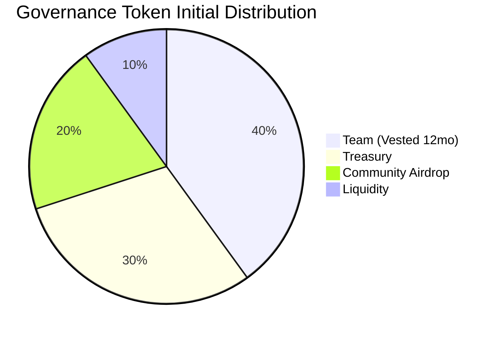

# Token Distribution Diagram

This diagram outlines the initial distribution of the Governance Token as required:

* **Team**: 40% (Vested over 12 months)
* **Treasury**: 30%
* **Community Airdrop**: 20%
* **Liquidity**: 10%

## Details
Total Supply: `100,000,000 GOV`
- **40,000,000 GOV** are minted to the `TokenVesting.sol` smart contract and released linearly over a period of 12 months.
- **30,000,000 GOV** are given directly to the DAO Treasury.
- **20,000,000 GOV** are allocated for Community Airdrop.
- **10,000,000 GOV** are supplied to exchanges/DEX for Liquidity.
